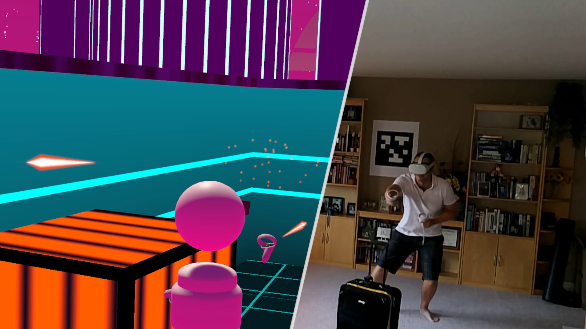
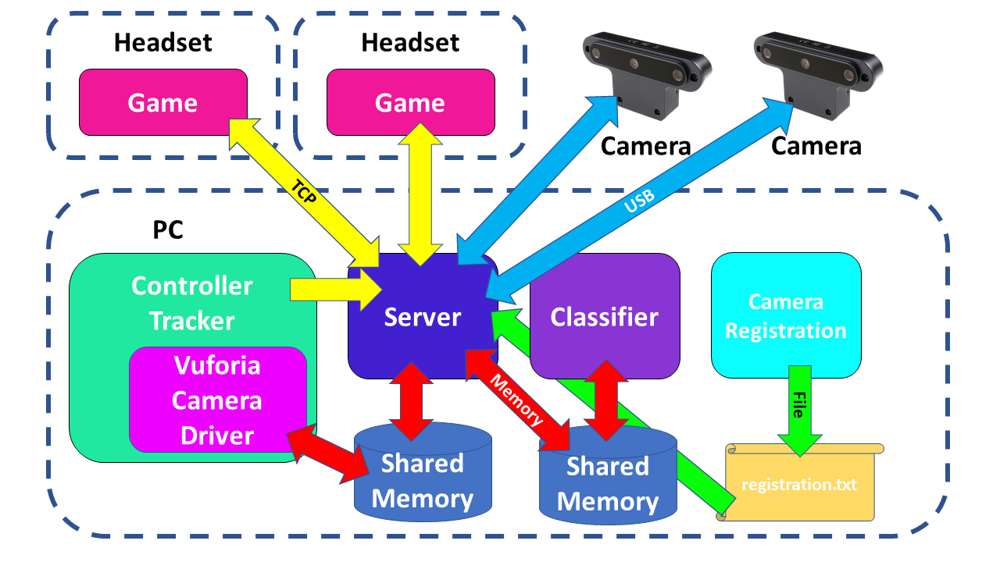
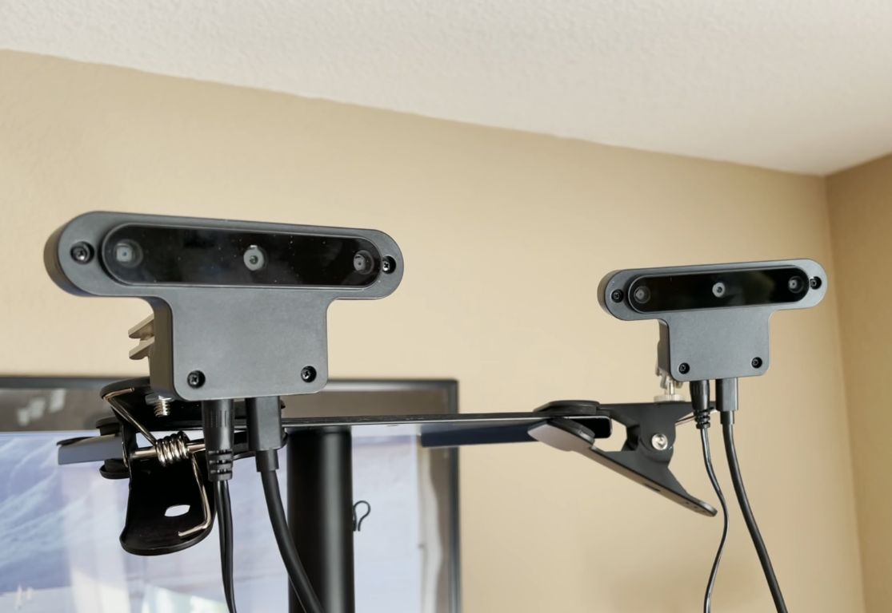
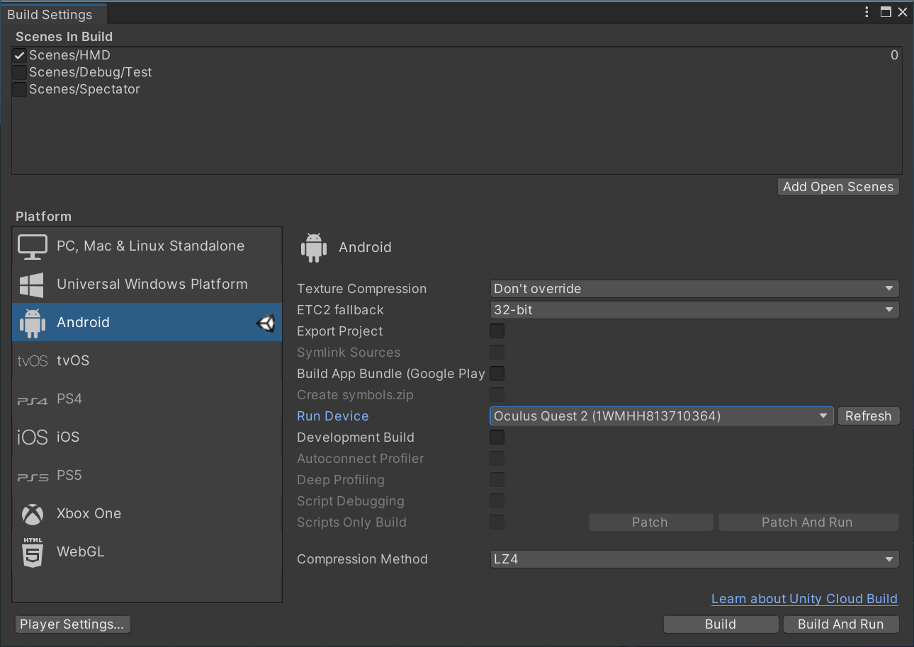

# Mixed Reality Laser Tag

*Copyright 2021 Bart Trzynadlowski*

## Overview



This is the source code to my Mixed Reality Laser Tag project, which won first prize for North America in the [OpenCV AI Competition 2021](https://opencv.org/opencv-ai-competition-2021/). Mixed reality experiences that build a virtual world conforming to the exact geometry of a physical space are mind-blowingly awesome. However, this has traditionally required the use of expensive motion tracking cameras costing thousands of dollars each. The capital costs for a single venue like [The Void](https://www.youtube.com/watch?v=WUs5qi_RFnM) can be as high as $500K USD or
more. Can something comparable be achieved using inexpensive off-the-shelf depth cameras like the $200 OAK-D? This project proves we can get most of the way there at a fraction of the cost.

Please view [the project video](https://www.youtube.com/watch?v=uvGqlmGOolk) for an overview of the system in action and an explanation of its principles of operation. The system itself is a Rube Goldberg machine of components.



Keep in mind this project is a very rough proof-of-concept developed in a matter of weeks. I don't expect anyone to actually attempt to run this code but it is technically possible to do so. I hope it serves as an inspiration for your own cool mixed reality projects.

**NOTE:** All licensed assets have been stripped out of this repository and replaced with "gray box" versions.

## Setup Instructions

The physical set up and build process is documented to the best of my ability here. There is no automated build system. Windows on x86-64 is the only supported platform.

### Camera Setup

At least one OAK-D device is required and up to two are supported (extending the code to support more would not be that difficult), in which case the fields of view must overlap slightly. To record [my video](https://www.youtube.com/watch?v=uvGqlmGOolk), I placed two cameras on a speaker stand, as shown below.



When using two cameras, a registration procedure involving a calibration target must be performed. The calibration target is a particular AprilTag printed on a rigid matte 22 x 28 inch poster board. A PDF of the target suitable for printing at e.g., FedEx, is available in `assets/calibration_board`. Note that the
actual printed size may differ. Mine was about half an inch shorter along each dimension. The AprilTag itself is smaller than the poster board and its precise measurement should be taken and updated in `src/python/vision/apriltags.py` accordingly.

### Wall Setup

For each wall in your convex play space, print the AprilTag in `assets/walls` on an 8.5 x 11 inch sheet of paper. The AprilTag itself should measure 15.3 cm on a side if printed correctly. You can measure and adjust the value in `src/python/vision/apriltags.py` as needed. Paste a tag onto each wall and make sure that
the paper is as flat as possible against the wall. Any bowing of the paper will degrade the accuracy of the estimated pose. It is also possible to use a second tag (ID code 2 at `assets/apriltags/tag36_11_00002.png`) printed at a much larger size. A PDF for this is not provided but I printed it on poster paper at
43.7 cm. You can use any size you like provided you update `apriltags.py` accordingly.

### Python Setup

Two different Python environments are required for running the laser tag server and the object classification service. I recommend using [Anaconda](https://conda.io/) to manage this. Once installed, create the first environment, for the laser tag server, as follows:

```
conda create -n mrlasertag python=3.8
```

Then, activate this environment:

```
conda activate mrlasertag
```

While in this environment, install the required packages. At the root of the project directory is `requirements.txt`. Install the packages enumerated therein:

```
pip install -m requirements.txt
```

Next, open a new Anaconda Command Prompt window and create a second environment for the classifier (note the different Python version):

```
conda create -n maskrcnn python=3.6
```

Activate the environment:

```
conda activate maskrcnn
```

And in `thirdparty/maskrcnn`, install the required packages for this environment.

```
cd thirdparty\maskrcnn
pip install -m requirements.txt
```

### Building AprilTag Library for Python Server

The build process assumes [MSYS2](https://www.msys2.org/) or an equivalent UNIX-style terminal is being used. Ensure both **cmake** and **mingw32-make** are installed.
To build, type:

```
mingw32-make
```

This will build the third-party **apriltag** library. To keep things as simple as possible, it is assumed that the library will *not* be modified and therefore, its source files are not tracked by the
Makefile. They are built from a clean start each time if and only if the build output in the `bin` directory is missing. If you find yourself needing to make a change in the library, make sure to delete the build output before running **mingw32-make** again:

```
mingw32-make clean
```

### Building Vuforia UWP Camera Driver DLL

**Visual Studio 2019** is required for this step. For now, the Vuforia UWP camera driver project is not integrated with the Makefile and must be
built manually. Open ```src/model_tracker/vuforia_driver/build/DriverTemplate.sln``` in Visual Studio. Make sure the selected configuration is
*Release* and the architecture is *x64*, then build the solution (Ctrl+B). This will produce ```src/model_tracker/vuforia_driver/build/Release/DriverTemplate.dll```,
which we will later copy over to the Unity controller tracking app build directory.

### Building VuforiaControllerTracker UWP App

Open the **VuforiaControllerTracker** Unity project. Select *File* then *Build Settings*. Make sure the selected platform is *Universal Windows Platform*, the target device is *PC*, and the architecture is *x64*.


Click *Build*. When prompted for a folder, create a new folder named *App*, located at ```unity/VuforiaControllerTracker/App```. Once finished, enter the ```model_tracker``` directory and run
```copy_driver.bat```. From a Windows Command Prompt (rather than MSYS2), this would look like:

```
cd src\model_tracker
copy_driver.bat
```

This will copy the Vuforia UWP camera driver DLL, ```DriverTemplate.dll``` to two locations in the generated application build folder.

Finally, build the application by opening ```unity/VuforiaControllerTracker/App/VFModelTarget.sln```.

In Visual Studio's Solution Explorer, right click on *VFModelTarget (Universal Windows)*, select *Publish* and then *Create App Packages...*.

Select *Sideloading* when prompted for the distribution method. For the signing method, the option to use a default certificate should be available as:
*Yes, use the current certificate*. Finally, at the *Select and configure packages* dialog, make sure only the *x64* architecture is selected with
the *Release (x64)* configuration. Click *Create* and the package should be generated. You will then be able to open the folder and double-click
on the .appx file to install and then launch it.

When installing the app package while a previous installation exists, the following error may occur:

```
App installation failed with error message: The current user has already installed an unpackaged version of this app. A packaged version cannot replace this. The conflicting package is Template3D and it was published by CN=DefaultCompany. (0x80073cfb)
```

To remove the existing package, open a PowerShell window with admin permissions and run the following command to get the full package name:

```
get-appxpackage -name Template3D -AllUsers
```

Then remove it, replacing *\<PackageFullName\>* with the name obtained from the previous command.

```
remove-appxpackage -package <PackageFullName> -AllUsers
```

The package should now install itself.

### Building the LaserTag Unity App

The *HMD* scene located in `Assets/Scenes` of the **LaserTag** Unity project can be deployed to an Oculus Quest 2 by building an APK or can be run from the editor using Oculus Link. When building an APK, make sure only the *HMD* scene is included and follow the procedure recommended by Oculus.



There is also a *Spectator* scene which is intended to be run on the PC. It can be run directly from the editor or built as a standalone Windows binary.

**NOTE:** The host address of the server is hard coded to `192.168.0.100` and must be changed before building to match your server PC address. This is located on the *Network* game object under either *HMDApp* or *SpectatorApp*, depending on which scene you are in. The port should not be changed because it is hard-coded to 6810 in `src/python/networking/tcp.py`.

 

## Running

If using two cameras, camera registration must be performed initially and any time the cameras are moved. The calibration board must be captured by both cameras simultaneously before the app can be terminated. The calibration procedure is shown briefly in the [project video](https://www.youtube.com/watch?v=uvGqlmGOolk). Run the registration process using the following command in the `mrlasertag` environment:

```
conda activate mrlasertag
python -m src.python.registercams --file=assets/registration.txt
```

When running the laser tag system, the **VuforiaControllerTracker** app should be launched first, followed by the classifier, which must be run in the `maskrcnn` environment:

```
conda activate maskrcnn
python -m src.python.classifier
```

Launch the server next from the `mrlasertag` environment:

```
conda activate mrlasertag
python -m src.python.mrlasertag -device=14442C10A165C0D200
```

Replace `14442C10A165C0D200` with the device ID of one of your cameras. Device IDs can be obtained by running `registercams`.

Finally, deploy the *HMD* scene of the **LaserTag** Unity app to one or more Quest 2 headsets. A spectator may also be brought up.

### Headset Registration

Each time the Quest 2 *LaserTag* app is launched, headset registration must be performed. This is shown in [the video](https://www.youtube.com/watch?v=uvGqlmGOolk). The procedure is:

- Press B on the right-hand controller to enter registration mode.
- Observe the *VuforiaControllerTracker* window by lifting the headset up slightly (do not remove it completely or the app will be suspended), which should now display the OAK-D camera stream.
- Hold the controller in front of the camera and ensure the tracker window detects it and renders a virtual copy with the exact same position and orientation. Press A on the controller to capture a point.
- Capture at least 2-3 more points (3-4 total), ensuring that the controller is being tracked each time.
- Press B again when satisfied to end registration. Now the detected walls and objects should pop into existence at the correct locations.

### Troubleshooting

- If the Quest 2 app appears frozen upon launch, it is likely having trouble connecting to the server. I lazily left the blocking connection logic in the Unity main thread, which will completely freeze the application while connecting. Make sure you specified the correct IP address on your LAN prior to building and deploying.
- If the *VuforiaControllerTracker* window displays only a black screen during headset registration, this likely means the Python server was not able to open the shared memory buffer because the UWP application ID on your machine differs from mine. This ID is hard-coded into the shared memory object handle strings in `src/python/vision/vuforia.py`. You can obtain the ID on your system by uncommenting the following code in `src/model_tracker/vuforia_driver/src/RefDriverImpl.cpp`, re-building the DLL and *VuforiaControllerTracker*, and running it. The named object path to use in `vuforia.py` will be printed as a debug string which, unfortunately, requires using an application like [DebugView](https://docs.microsoft.com/en-us/sysinternals/downloads/debugview) to observe.

```
  /*
  // This code gets the app container named object path
  wchar_t objectPath[1024];
  unsigned long objectPathLength = 0;
  if (!GetAppContainerNamedObjectPath(nullptr, nullptr, 1024, objectPath, &objectPathLength))
  {
    Platform::log("Failed to get app container's named object path!");
  }
  else
  {
    std::wstring ws(objectPath, objectPathLength);
    using convert_type = std::codecvt_utf8<wchar_t>;
    std::wstring_convert<convert_type, wchar_t> converter;
    std::string path = converter.to_bytes(ws);
    Platform::log(Util::Format() << "App container named object path: " << path);
  }
  */
```

## Acknowledgments

Mixed Reality Laser Tag includes the following third-party code:

- [AprilTag detector](https://github.com/swatbotics/apriltag) by the University of Michigan and Matt Zucker
- [MaskRCNN](https://github.com/matterport/Mask_RCNN) implementation by Matterport
- [Vuforia](https://vuforia.com/) by PTC
